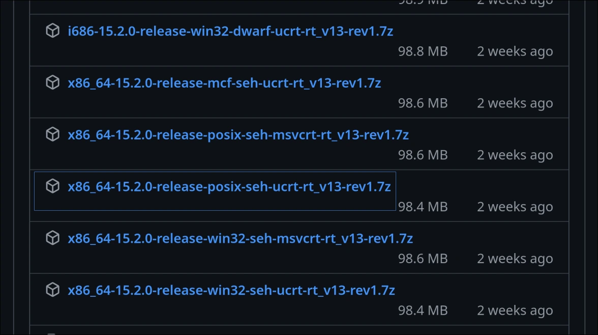
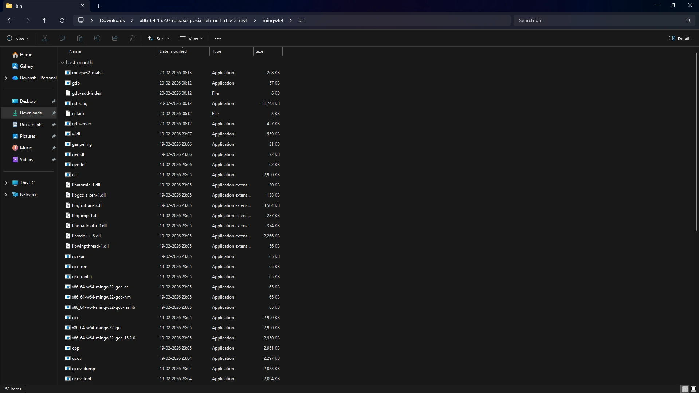
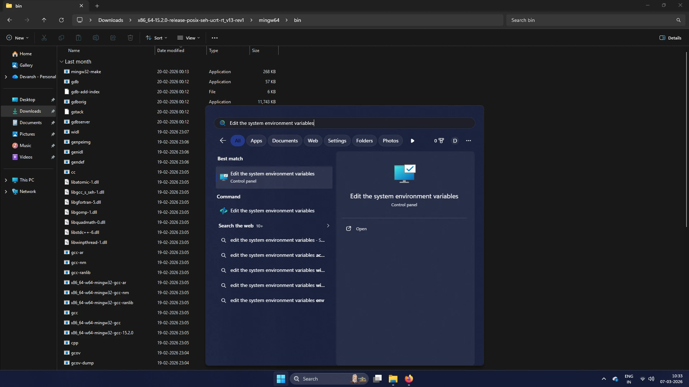
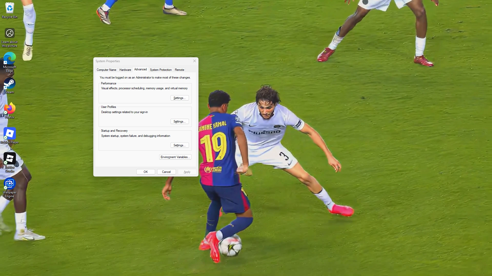
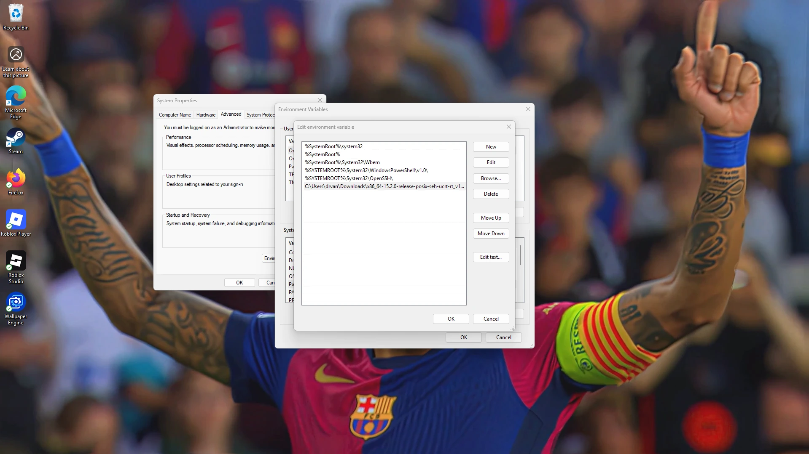
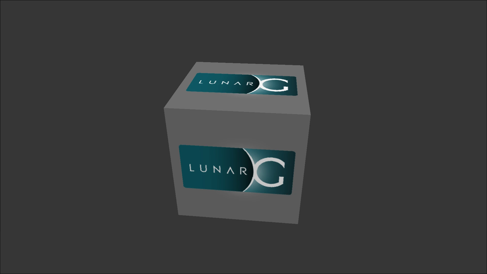

Time to set up the development environment.
We will mainly target Linux and Windows. macOS support is not planned, but might be added later.

## Code Editor

First, we need a code editor. There are numerous options, and I advise you use the one you're most comfortable with. But if you want to follow along with me, that's fine too.

I'm going to use VSCodium here and set up its environment. You can use VS Code too — there's no real difference between them, just that VS Code uses some telemetry.

- Install **VSCodium** from here — https://github.com/VSCodium/vscodium/releases
- Or **VS Code** from here — https://code.visualstudio.com/

On Linux you can also install via your package manager if your distro's repository has those packages.

Fire it up once and customize it however you like.

## Compiler

We're going to be using GCC (GNU Compiler Collection). You can use any compiler of your choice, just make sure it has at least C++17 support.

### Windows

Make sure you're using the 64 bit version and not the old deprecated 32 bit GCC.

Go to — https://www.mingw-w64.org/
or directly install from — https://github.com/niXman/mingw-builds-binaries/releases

Install the `posix_seh_ucrt_rt` one, as shown in the image below.



After installing, navigate to the downloaded zip and extract it. Then navigate to the `bin` folder inside the extracted files and copy the path at top.



Now open **"Edit Environment Variables"**

Click on "Environment Variables"

Then Click on Edit->New, and paste your copied folder path there

Then clicl Ok->Ok. Thats it.


<!-- IMAGE: Environment Variables window with path added -->

After that, open up PowerShell and type:

```powershell
g++ --version
```

It should output the version of your compiler.

If it doesn't, you must've entered the wrong path — make sure you point to the `bin` directory inside your extracted folder.

### Linux

```bash
# Ubuntu/Debian
sudo apt install build-essential

# Arch
sudo pacman -S gcc

# Fedora/RHEL
sudo dnf install gcc-c++

# OpenSUSE
sudo zypper install gcc gcc-c++

# Gentoo
sudo/doas emerge -av dev-libs/gcc
```

:::note
Gentoo users — make sure you have the `cxx` USE flag enabled.
:::


Verify your installation by opening a terminal and typing:

```bash
g++ -v
```

It should print out your compiler version.

## Vulkan SDK

Now we need the Vulkan SDK installed on our system.

### Windows

Navigate here — https://vulkan.lunarg.com/sdk/home

Install the SDK. The LunarG installer automatically adds everything to your environment PATH, so you don't need to do it manually.

### Linux

```bash
# Ubuntu/Debian
sudo apt install vulkan-tools libvulkan-dev vulkan-validationlayers spirv-tools

# Arch
sudo pacman -S vulkan-headers vulkan-validation-layers vulkan-tools

# Fedora/RHEL
sudo dnf install vulkan-tools vulkan-headers vulkan-validation-layers-devel

# Gentoo
sudo/doas emerge -av media-libs/vulkan-loader dev-util/vulkan-tools

# OpenSUSE
sudo zypper install vulkan-tools vulkan-devel vulkan-validationlayers
```

:::note
Gentoo users — enable the `vkcube` USE flag for `dev-util/vulkan-tools`.
:::


## Verify Installation

Now open a terminal and type:
```bash
vkcube
```

You should see a spinning cube like this:



:::tip
If you got this, voila!! You've set up Vulkan correctly. You should also see your GPU name printed in the terminal.
:::

:::caution
If you don't see the cube, make sure your drivers are up to date — 99% of the time that's the fix.
:::

## Project Structure

At the time being, since the project will only have a header (`.hpp`) and a source (`.cpp`) file, there's no need to complicate things. Later I'll share how I set up my own development environment for a clean and organized structure.

## Conclusion

The development environment is now set up. In the next chapter, we'll do something cooler — open a **window**.
