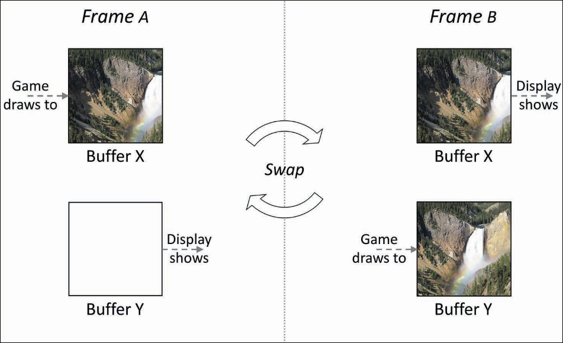

Now that we've done the setup, let's fire up our code editor. Open your project and make a file named `hellovulkan.cpp` (or anything you want).

Add the following includes at the top:

```cpp
#define GLFW_INCLUDE_VULKAN
#include <GLFW/glfw3.h>
#include <stdio.h>
```

If you don't see any warnings or errors in your IDE, congratulations — you've set up everything correctly.

## Initializing GLFW

Now let's add the main function:

```cpp
int main()
{
        // initialize GLFW
        glfwInit();
        glfwWindowHint(GLFW_CLIENT_API, GLFW_NO_API);
        glfwWindowHint(GLFW_RESIZABLE, GLFW_FALSE);
}
```

In the main function, we first initialize GLFW with `glfwInit()`. Then we configure GLFW with `glfwWindowHint`. The first argument tells us what option we want to configure, selected from a large enum of possible options prefixed with `GLFW_`. The second argument is an integer that sets the value of that option. A list of all possible options can be found in [GLFW's window handling documentation](https://www.glfw.org/docs/latest/window_guide.html).

Since GLFW was originally designed to create an OpenGL context, we call `glfwWindowHint` and tell it not to create one by setting `GLFW_CLIENT_API` to `GLFW_NO_API`.

Since window resizing is another thing to take care of, we'll look into it later and just disable it for now by setting `GLFW_RESIZABLE` to `GLFW_FALSE`.

## Creating the Window

Now let's create our window object. This window object is basically the master key for our window — any configuration or info we retrieve regarding the window, we need to pass this object.

```cpp
// create window object
GLFWwindow* window = glfwCreateWindow(800, 600, "Hello Vulkan", nullptr, nullptr);
```

- **First and second argument** — width and height of the window
- **Third argument** — title of our window
- **Fourth argument** — which monitor to display on. `nullptr` creates a windowed mode window, `glfwGetPrimaryMonitor()` would make it fullscreen — we don't want that right now
- **Fifth argument** — For sharing OpenGL contexts between multiple windows, irrelevant for Vulkan, just pass `nullptr`

Now let's check if the window was created properly:

```cpp
if (window == nullptr)
{
        printf("Could not initialize window, exiting\n");
        return 1;
}
```

## Theory — How Things Get Displayed

Before we continue, let's understand how things actually get displayed on a monitor.

### Display

Most displays today — whether televisions, monitors, tablets, or smartphones — use raster graphics, meaning the display has a two-dimensional grid of pixels. The resolution refers to the width and height of this grid. For example, our window resolution is 800×600. These pixels individually display different amounts of light and color, combining to create a perception of a continuous image. The GPU provides the display data(basically drawing, which pixel has what color etc.), the display then procees read and light up pixels accordingly. This whole process is known as [rasterization](https://en.wikipedia.org/wiki/Rasterisation)..

### Buffering

Every iteration of the loop, we update the pixels on the screen. Most of you might think it's simple — draw on the screen, then next loop draw on it again. What if your display was still reading the last frame, but we reached the next iteration and the GPU started drawing the current frame? The display would start reading new data and show new image while also it was drawing image of previous frame. This phenomenon is known as **screen tearing**.


Here's how we counter it. Say there are two images, one kept behind the other. Every iteration:

1. We erase everything on the **back** image to clearn any data of the last frame
2. We draw our current frame to the **back** image
3. At the end of the loop, we **swap** both images

The one we just drew to is now at the front — that's what gets displayed. The old front image moves to the back, and we repeat. This process is called **Double Buffering**, and those two images are called buffers (front and back buffers).



Of course, given how powerful hardware has gotten, screen tearing can still happen. To tackle that, at the end of every loop we wait until the display has finished drawing the front buffer before swapping. This process is known as **Vertical Synchronisation** — or VSync, as many gamers call it.


## Game Loop

A game loop is a loop that runs throughout the lifetime of the program and controls its overall flow. Any game you play is basically a simple game loop that does the same things repeatedly every iteration until it's signaled to stop. You've probably heard people say a game must run at at least 60fps — in programming terms that means the game loop is running at least 60 times every second.

A simple anatomy of a game loop:

1. Process inputs
2. Update the program accordingly (Physics, AI, Audio etc.)
3. Generate output

To implement a single game loop, write following:

```cpp
// game loop
while (glfwWindowShouldClose(window) != true)
{
        // poll all events
        glfwPollEvents();
}
```

:::note
In OpenGL, we would have called `glfwSwapBuffers(window)` at the end of the loop — which would make more sense given we just learned about double buffering. But since we told GLFW not to create any context, it hasn't done so. We will be creating those buffers manually in Vulkan.
:::

The while loop checks whether the window should close. If GLFW is instructed to close, `glfwWindowShouldClose` returns true and we exit the loop.

`glfwPollEvents()` processes any pending events — mouse clicks, keyboard input, etc. We'll be using one of these shortly.

## Cleanup

Once the program exits the main loop, we need to clean up:

```cpp
// cleanup
glfwDestroyWindow(window);
glfwTerminate();
return 0;
```

We destroy the window by passing the window object to `glfwDestroyWindow`, then signal GLFW to shut itself down via `glfwTerminate()`.

## Compiling

Let's compile our program. Open your terminal and run:

```bash
# Linux
g++ hellovulkan.cpp -o hellovulkan -L./lib -lglfw3 -ldl

# Windows
g++ hellovulkan.cpp -o hellovulkan -L./lib -lglfw3 -lgdi32 -luser32 -lkernel32
```

- `g++` — the compiler
- `hellovulkan.cpp` — the file we're compiling
- `-o hellovulkan` — the output executable name
- `-L./lib` — look in the `lib` folder for libraries
- `-lglfw3` - Link the GLFW library
- The rest are OS libraries that GLFW require

Run it with:
What if the GPU swapped the buffers
```bash
./hellovulkan
```

You should see something like this:

<!-- IMAGE: empty window screenshot -->

If it's a dull empty window — you did everything right!! Congratulations on making your first window! 
:::note
Wayland users — don't panic if you don't see a window appear yet. Unlike X11, Wayland compositors won't show your window until you actually present something to it. So sadly you'll only be seeing a window by the end of this section when we draw our first frame :(
:::

## Input

Now we need a way to close the window. We want pressing Escape to close it — meaning when Escape is pressed, `glfwWindowShouldClose` should be set to true:

```cpp
while (!glfwWindowShouldClose(window))
{
        // poll all events
        glfwPollEvents();

        // close window on escape
        if (glfwGetKey(window, GLFW_KEY_ESCAPE) == GLFW_PRESS)
        {
                glfwSetWindowShouldClose(window, true);
        }
}
```

`glfwGetKey` takes a window object and a key, and returns whether that key is currently pressed. If it's not pressed, it returns `GLFW_RELEASE`.

Recompile and run — pressing Escape should now close the window.

We now have a window up and running. From the next chapter, we will start Vulkan. 

---

**[Source Code is available here](https://codeberg.org/curl0z/vklearn/src/branch/master/Getting%20Started/Hello%20Window)**
## Extra Resources

| Resource | Description |
|---|---|
| [LearnOpenGL — Hello Window](https://learnopengl.com/Getting-started/Hello-Window) | LearnOpenGL's equivalent chapter, good reference |   
