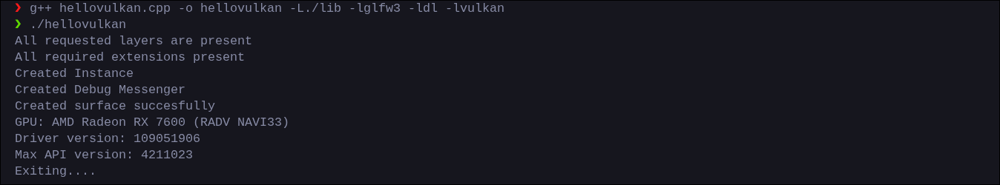
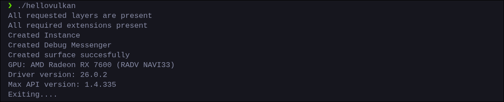
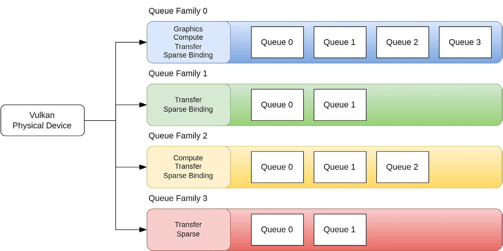

Ok so today we are going to select what GPU or physical device in vulkan terms, we are going to use.

The handle for physical device is stored as a `VkPhysicalDevice` object. So lets now create our physical device handle -

```cpp
// hellovulkan.cpp

// Surface Creation Above

// Physical Device
VkPhysicalDevice physicalDevice = VK_NULL_HANDLE;
```

Gaming laptop users might be familiar with this but, many computers have 2 GPU's, one discrete and one integrated one.
In many computers there are even more GPU's present (server PC's or crypto miners), and vulkan does give you the power to use all of em simultaneously. But that is well, very much out of scope and I don't know how to do that either. So we'll just stick with using only one.

```cpp
// hellovulkan.cpp

// Physical Device
VkPhysicalDevice physicalDevice = VK_NULL_HANDLE;

uint32_t numPhysicalDevices = 0;
vkEnumeratePhysicalDevices(instance, &numPhysicalDevices, nullptr);
std::vector<VkPhysicalDevice> physicalDevices(numPhysicalDevices);
vkEnumeratePhysicalDevices(instance, &numPhysicalDevices, physicalDevices.data());
```

We query all the available physical devices via [vkEnumeratePhysicalDevices](https://docs.vulkan.org/refpages/latest/refpages/source/vkEnumeratePhysicalDevices.html). The approach should be pretty self explanatory at this point.

## Querying Physical Device's Information

Well, lets do something fun for a change and print out info about our gpu.

```cpp
// hellovulkan.cpp
for (int i = 0; i < physicalDevices.size(); ++i)
{
    VkPhysicalDeviceProperties deviceProperties;
    vkGetPhysicalDeviceProperties(physicalDevices[i], &deviceProperties);
    printf("GPU: %s\nDriver version: %u\nMax API version: %u\n",
        deviceProperties.deviceName,
        deviceProperties.driverVersion,
        deviceProperties.apiVersion
    );
}
```

Vulkan provides a [VkPhysicalDeviceProperties](https://docs.vulkan.org/refpages/latest/refpages/source/VkPhysicalDeviceProperties.html) struct that holds all the properties of our physical device.
We can query the properties of a certain physical device via `vkGetPhysicalDeviceProperties` as I have done above.
Then we proceed to loop over all the available physical devices and print their name, driver version and api version supported.


Now lets compile and see the info -

<!-- IMAGE: ugly version output -->

Ya-Uhhhhhhhhhhhhhh…….

Ok this looks ugly. Reason is simple. Vulkan stores those `apiVersion` and `driverVersion` as plain `uint32_t` in some weird bits format.

:::tip
In vulkan and software engineering in general, this versioning system is known as semantic versioning. It goes like this ->

1. Major — big breaking changes. A whole new version of the API that's incompatible with the previous one. Going from Vulkan 1 to Vulkan 2 would be a major change.
2. Minor — new features added but backwards compatible. Vulkan 1.3 added dynamic rendering over 1.2. Same API, just more stuff added. Your 1.2 code still works on 1.3.
3. Patch — bug fixes only. No new features, no breaking changes. Just "we fixed this crash" or "this behavior was wrong."

For example if the api version is 1.4.338, then major version is 1, minor version is 4, and patch version is 338.
Theres another 4th component in vulkan too, but you'll almost never see it.
:::

But, there IS a way to solve this. Vulkan provides macros to extract out their Major, minor and patch version via `VK_API_VERSION_MAJOR`, `VK_API_VERSION_MINOR` and `VK_API_VERSION_PATCH` respectively. Read more about them [here](https://vulkan.lunarg.com/doc/view/1.4.335.0/windows/antora/spec/latest/chapters/extensions.html#VK_API_VERSION_MAJOR)


```cpp
// hellovulkan.cpp
for (int i = 0; i < physicalDevices.size(); ++i)
{
    VkPhysicalDeviceProperties deviceProperties;
    vkGetPhysicalDeviceProperties(physicalDevices[i], &deviceProperties);
    printf("GPU: %s\nDriver version: %d.%d.%d\nMax API version: %d.%d.%d\n",
        deviceProperties.deviceName,
        VK_API_VERSION_MAJOR(deviceProperties.driverVersion),
        VK_API_VERSION_MINOR(deviceProperties.driverVersion),
        VK_API_VERSION_PATCH(deviceProperties.driverVersion),
        VK_API_VERSION_MAJOR(deviceProperties.apiVersion),
        VK_API_VERSION_MINOR(deviceProperties.apiVersion),
        VK_API_VERSION_PATCH(deviceProperties.apiVersion)
    );
}
```

Now it should print out nicely.

<!-- IMAGE: nice version output -->

Yayyyyy :)

## Selecting a Physical Device

Now, we need to select a device that is suitable for our needs. Right now our needs are -

1. **Vulkan 1.3 support** – Check if the device supports version 1.3
2. **Graphics support** – Check if the device can be used for graphics purposes
2. **Presentation support** – Check if the device can be actually present something

The second and third one might seem unnecessary as except some server GPU's, most support them. But well, I've kept it because it teaches another important concept we'll encounter in the next chapter.

Now for users with multiple GPU's, either we can select any gpu that passes the checks. Or, we can score the GPU's as per their features and performance and choose the best one.
We'll proceed with the latter approach.

### Checking 1.3 Support

```cpp
// hellovulkan.cpp
if (deviceProperties.apiVersion < VK_API_VERSION_1_3)
{
    printf("Physical Device: %s, Does not support vulkan 1.3\n", deviceProperties.deviceName);
    continue; // Wrote continue because then we'll not score this gpu
}
```

Here we just check if the api version the physical device supports is less than the macro [VK_API_VERSION_1_3](https://docs.vulkan.org/refpages/latest/refpages/source/VK_API_VERSION_1_3.html) which expands to the encoded version number for 1.3.

### Checking Graphics Support

Checking for graphics require knowledge of queues. So lets first learn what queues are.
### Queues
How do you think operations are performed on a GPU???

What happens is, we record command or the instructions ourselves, then send them to a particular `queue` in the GPU. A queue is a place where you store your commands. The GPU then picks command from the queue and proceeds to  perform it.
Now there are different types of queues. Some for graphics, some for presenting etc... each for different purposes. Notice how I said queue's'. Thats cuz, as u guessed, there are multiple of em. There are multiple queues that can perform an operation. 
The collection of all those queues that perform a certain operation is known as queue family. For example collection of all queues that perform graphics operations are known as graphics queue family.
Also, its possible that a queue can perform multiple operations(just not at same time).
See this image to understand better -



Presence of graphics queue is proof itself that GPU supports graphics. Now armed with all this knowledge, lets get back - 
```cpp
// hellovulkan.cpp
uint32_t queueFamilyCount = 0;
vkGetPhysicalDeviceQueueFamilyProperties(physicalDevices[i], &queueFamilyCount, nullptr);
std::vector<VkQueueFamilyProperties> queueFamilies(queueFamilyCount);
vkGetPhysicalDeviceQueueFamilyProperties(physicalDevices[i], &queueFamilyCount, queueFamilies.data());

// check for graphics support
bool graphicsSupport = false;
for (int j = 0; j < queueFamilies.size(); ++j)
{
    if (queueFamilies[j].queueFlags & VK_QUEUE_GRAPHICS_BIT)
    {
        graphicsSupport = true;
        break;
    }
}

if (!graphicsSupport)
{
    printf("Physical Device: %s, Does not support graphics\n", deviceProperties.deviceName);
    continue;
}
```
Ok so what have we done here.

First we retrieved all the present queues via vkGetPhysicalDeviceQueueFamilyProperties(i know the naming is weird) and stored them in a vector.
Then we looped over all queues and checked if the `VK_QUEUE_GRAPHICS_BIT` is enabled in that queue's flags. 

For example. say graphics BIT is 0001, and flags(BITS) enabled for current queue is 1101.
If we use & operator, we are left with 1 aka non zero. Which is as we all know in C++ means true.

### Checking for presentation support
Checking for presentation support is similar to graphics, but a bit easier as there is a direct function that tells us if present support is present or not - 
```cpp
uint32_t queueFamilyCount = 0;
vkGetPhysicalDeviceQueueFamilyProperties(physicalDevices[i], &queueFamilyCount, nullptr);
std::vector<VkQueueFamilyProperties> queueFamilies(queueFamilyCount);
vkGetPhysicalDeviceQueueFamilyProperties(physicalDevices[i], &queueFamilyCount, queueFamilies.data());

// flag for graphics support
bool graphicsSupport = false;
// flag for present support
VkBool32 presentSupport = false;
for (int j = 0; j < queueFamilies.size(); ++j)
{
    // Graphics Support
    if (queueFamilies[j].queueFlags & VK_QUEUE_GRAPHICS_BIT)
        graphicsSupport = true;

    // Present Support
    vkGetPhysicalDeviceSurfaceSupportKHR(physicalDevices[i], i, surface, &presentSupport);

    if (graphicsSupport && presentSupport)
        break;

}

if (!graphicsSupport || !presentSupport)
{
    printf("Physical Device: %s, is not suitable\n", deviceProperties.deviceName);
    continue;
}
```

### Scoring the GPU's

Now just above the loop, add a variable that will keep the maximum score:

```cpp
// hellovulkan.cpp
uint32_t maxScore = 0;
```

Now, our first scoring parameter is gonna be `maxImageDimension2D`.
Its is basically the largest dimension (height or width) of an image.

:::note
I know I taught in the "Hello Window" chapter that it is "buffer" that we present on the screen. But in vulkan terms, its kind of different. What we present on the screen aka what the monitor draws, is called an "Image". While "buffer" is just a plain raw block of data. Confusing :( but it is what it is. 

Think of an image as a special type of buffer but in a special format.
:::

Second is going to be a simple check if the GPU is discrete or not.

```cpp
// hellovulkan.cpp
// this device's local score
uint32_t deviceScore = 0;

// First parameter - Checking for maximum image size 
deviceScore += deviceProperties.limits.maxImageDimension2D;

// Checking if the device is Discrete or not
if (deviceProperties.deviceType == VK_PHYSICAL_DEVICE_TYPE_DISCRETE_GPU)
    deviceScore += 10000; // This is basically a no brainer. Discrete is always the fastest.

// Final comparison with previous devices to see if current device has a better score
if (deviceScore > maxScore)
{
    maxScore = deviceScore;
    physicalDevice = physicalDevices[i];
}
```

After this, we can just add a check if our program actually selected a suitable gpu or not:

```cpp
// hellovulkan.cpp
if (physicalDevice == VK_NULL_HANDLE)
{
    printf("No Suitable GPU found, Exiting....\n");
    return 1;
}
VkPhysicalDeviceProperties deviceProperties;
vkGetPhysicalDeviceProperties(physicalDevice, &deviceProperties);
printf("Selected GPU: %s\n", deviceProperties.deviceName);
```

And well, thats all. Now lets just create a function -

```cpp
// boilerplate.hpp

bool selectPhysicalDevice(VkInstance instance, VkSurfaceKHR surface, VkPhysicalDevice *pPhysicalDevice)
{
    uint32_t numPhysicalDevices = 0;
    vkEnumeratePhysicalDevices(instance, &numPhysicalDevices, nullptr);
    std::vector<VkPhysicalDevice> physicalDevices(numPhysicalDevices);
    vkEnumeratePhysicalDevices(instance, &numPhysicalDevices, physicalDevices.data());

    uint32_t maxScore = 0;
    for (int i = 0; i < physicalDevices.size(); ++i)
    {
        VkPhysicalDeviceProperties deviceProperties;
        vkGetPhysicalDeviceProperties(physicalDevices[i], &deviceProperties);
        printf("GPU: %s\nDriver version: %d.%d.%d\nMax API version: %d.%d.%d\n",
            deviceProperties.deviceName,
            VK_API_VERSION_MAJOR(deviceProperties.driverVersion),
            VK_API_VERSION_MINOR(deviceProperties.driverVersion),
            VK_API_VERSION_PATCH(deviceProperties.driverVersion),
            VK_API_VERSION_MAJOR(deviceProperties.apiVersion),
            VK_API_VERSION_MINOR(deviceProperties.apiVersion),
            VK_API_VERSION_PATCH(deviceProperties.apiVersion)
        );

        if (deviceProperties.apiVersion < VK_API_VERSION_1_3)
        {
            printf("Physical Device: %s, Does not support vulkan 1.3\n", deviceProperties.deviceName);
            continue;
        }

        // check graphics support
        uint32_t queueFamilyCount = 0;
        vkGetPhysicalDeviceQueueFamilyProperties(physicalDevices[i], &queueFamilyCount, nullptr);
        std::vector<VkQueueFamilyProperties> queueFamilies(queueFamilyCount);
        vkGetPhysicalDeviceQueueFamilyProperties(physicalDevices[i], &queueFamilyCount, queueFamilies.data());

        bool graphicsSupport = false;
        for (int j = 0; j < queueFamilies.size(); ++j)
        {
            if (queueFamilies[j].queueFlags & VK_QUEUE_GRAPHICS_BIT)
            {
                graphicsSupport = true;
                break;
            }
        }

        if (!graphicsSupport)
        {
            printf("Physical Device: %s, Does not support graphics\n", deviceProperties.deviceName);
            continue;
        }

        // this device's local score
        uint32_t deviceScore = 0;

        // First parameter - Checking for maximum image size 
        deviceScore += deviceProperties.limits.maxImageDimension2D;

        // Checking if the device is Discrete or not
        if (deviceProperties.deviceType == VK_PHYSICAL_DEVICE_TYPE_DISCRETE_GPU)
            deviceScore += 10000; // This is basically a no brainer. Discrete is always the fastest.

        // Final comparison with previous devices to see if current device has a better score
        if (deviceScore > maxScore)
        {
            maxScore = deviceScore;
            *pPhysicalDevice = physicalDevices[i];
        }
    }

    if (*pPhysicalDevice == VK_NULL_HANDLE)
    {
        printf("No Suitable GPU found, Exiting....\n");
        return false;
    }

    return true;
}
```

And replace all that with just the function call in `hellovulkan.cpp`:

```cpp
// hellovulkan.cpp
// Physical Device
VkPhysicalDevice physicalDevice = VK_NULL_HANDLE;
if (!selectPhysicalDevice(instance, &physicalDevice))
{
    printf("Exiting....\n");
    return 1;
}
VkPhysicalDeviceProperties deviceProperties;
vkGetPhysicalDeviceProperties(physicalDevice, &deviceProperties);
printf("Selected GPU: %s\n", deviceProperties.deviceName);
```
### Retrieving queue family indexes
Just one last thing left. we need to retrieve the queue family indexes (Yes, the families are just indices).

Compile and see if everything is fine. 

:::note
Since we didnt explicitly call any vkCreatePhysicalDevice (make a new GPU), theres no reason the destroy the handle. Reason is simple, what if we accidentally destroyed our gpu via vkDestroyPhysicalDevice (-_-)
. Ok that was lame but reason is similar. We are not creating anything new, just retrieving handle to it. Handle would be automatically destroyed when instance is destroyed
:::

---


**[Source Code is available here](https://github.com/curloz123/vklearn/tree/master/Getting%20Started/Physical%20Device)**

| Resource | Description |
|---|---|
| [Vulkan-tutorial — Physical devices and queue families](https://vulkan-tutorial.com/Drawing_a_triangle/Presentation/Window_surface) | Vulkan-tutorial's equivalent chapter, good reference |   