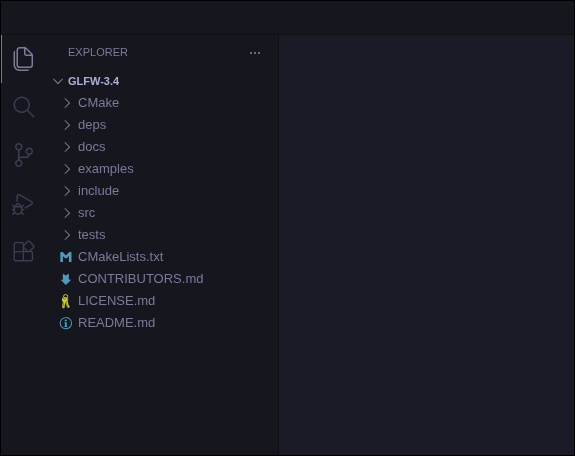
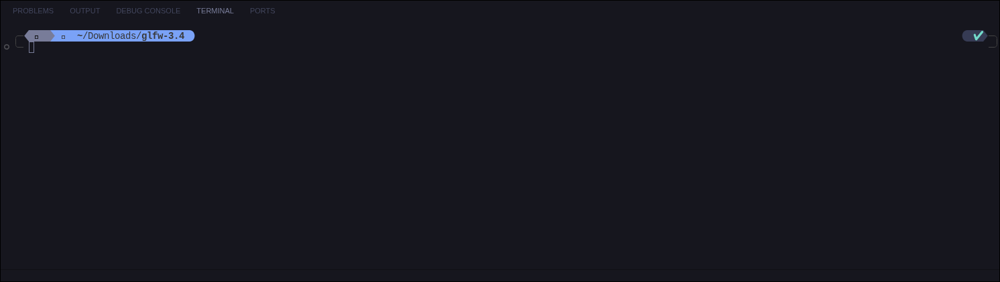
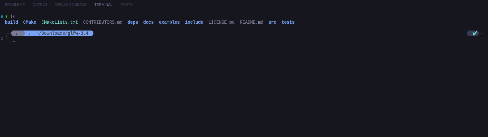
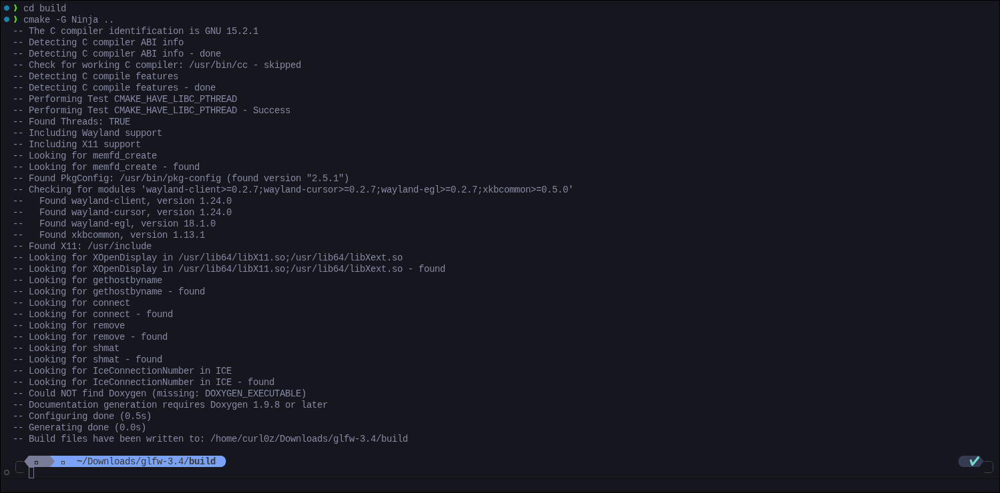
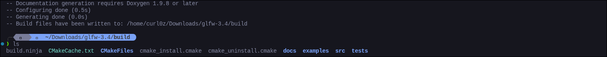
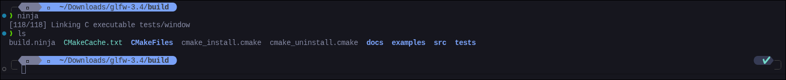
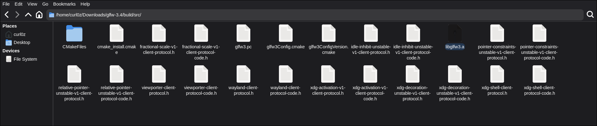
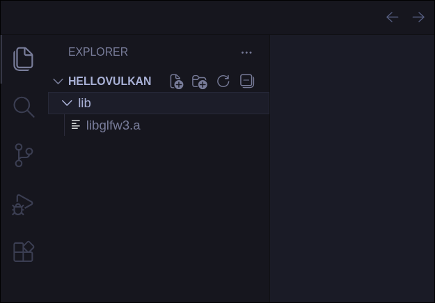
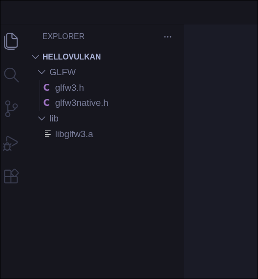

Ok so, where do you think we're gonna show our stuff on…

A **Window!!** Of course.

The first step for us to render anything on screen is window creation. Besides that, we also need to detect input events — say a right click fires a command in the game. You get the point.
:::note
Not everything you render will specifically be shown on the screen. 
A good example of that is offscreen rendering, but that's an 
advanced topic left for later.
:::
Now there are several ways to create a window. Every operating system has its own method — Windows has the Win32 API, macOS has Cocoa, Linux has X11 and Wayland.

But writing different code for every operating system is a pain (many AAA companies do this though). So to ease our process we have libraries — and with that, comes the introduction to our first library.

## GLFW

GLFW is a FOSS (Free and Open Source) windowing library written in C. It was initially created as a windowing library for OpenGL, but Vulkan support got added later too. It's a simple, easy to use library — and the best part is it's cross-platform, supporting Linux, macOS, Windows, and FreeBSD (community maintained). So we don't need to write different code for every platform. And before you question, it also handle inputs too.

## Building From Source

We are going to build GLFW from source, meaning we are going to compile its source code on our own machine. For that we need two building tools:

### CMake

A free, cross-platform software development tool for building applications. We're gonna use this to generate our build system — a system that compiles all our files. Don't worry, it's just a file that when executed, will compile everything.

**Windows** — Install the installer from here: https://cmake.org/download/

Run it and make sure you tick the **"Add to PATH"** option — this will save you the trouble of doing it manually.

**Linux:**

```bash
# Ubuntu/Debian
sudo apt install cmake

# Arch
sudo pacman -S cmake

# Fedora/RHEL
sudo dnf install cmake

# OpenSUSE
sudo zypper install cmake

# Gentoo
sudo/doas emerge -av dev-build/cmake
```

Verify your installation:
Open up a terminal and type

```bash
cmake --version
```

### Ninja

A low level, fast build system. This is what CMake will generate for us.

**Windows** — Download the zip from here: https://github.com/ninja-build/ninja/releases

Extract it and add the folder to your environment PATH the same way we did in the last chapter.

**Linux:**

```bash
# Ubuntu/Debian
sudo apt install ninja-build

# Arch
sudo pacman -S ninja

# Fedora/RHEL
sudo dnf install ninja-build

# OpenSUSE
sudo zypper install ninja

# Gentoo
sudo/doas emerge -av dev-util/ninja
```

Verify: Open up a terminal and type

```bash
ninja --version
```

## Building GLFW

Now that the tools are installed, it's time to build GLFW :)
:::note
The following procedure applies the same to both Linux and Windows users.
:::
Download the source package from here: https://www.glfw.org/download.html

Extract the zip and open VSCodium. Open the extracted GLFW folder — it should look similar to this:


<!-- glfw_open -->

First, create a new folder named `build` inside glfw foler. Then open VS Codium's inbuilt terminal via **Terminal → New Terminal** at the top:

<!-- terminal_open.png -->

Type `ls` to see all contents in the directory — you should see the newly created `build` folder there.

<!-- ls_1.png -->

Now enter the build folder:

```bash
cd build
```

Generate the build system:

```bash
cmake -G Ninja ..
```

It should output something similar to this:

<!-- cmake_ninja.png -->

:::note
Don't worry if it's not exactly the same — just make sure it ends with **"Build files have been written to: xxxxx"**.
:::

Type `ls` and you should see a `build.ninja` file:

<!-- build_ninja.png -->

That's our build system. Now let's actually build it:

```bash
ninja
```

After a few seconds it should be done. Type `ls` again and you should see a `src` folder:

<!-- src.png -->

All the terminal work has now comenced(is that the right spelling?) — and so is building GLFW!

Open your file manager, navigate to the extracted GLFW folder, go to `build → src`, and you should see a `libglfw3.a` file. That's our library.

<!-- glfw3lib.png -->

:::note
Please don't curse at me, but you could have straight away downloaded the pre-built library from the site. But thing is not every library will have that convenience available for you. This was all to teach you the process of compiling open source libraries yourself. Trust me, you'll thank me later ;)
:::

## Starting the Project

Let's start the project now. Create a new folder named `hellovulkan` (or anything you want), and open it in VSCodium.


First, create a `lib` folder — this is where we'll keep our libraries (right now just GLFW). Paste the `libglfw3.a` file inside it:

<!-- hv_lib.png -->

Next, we need GLFW's include files to actually use its functions. Head back to the extracted GLFW folder, navigate to the `include` folder and you'll see a `GLFW` folder inside. Copy it and paste it into our project folder:

Your project should now look like this:

<!-- final.png-->

And that's all the setup done. Seriously now, we can start coding. 

:::caution
Thats a lot of images, and was a nightmare to take all the screenshots, IM NOT DOING THAT EVER AGAIN
:::